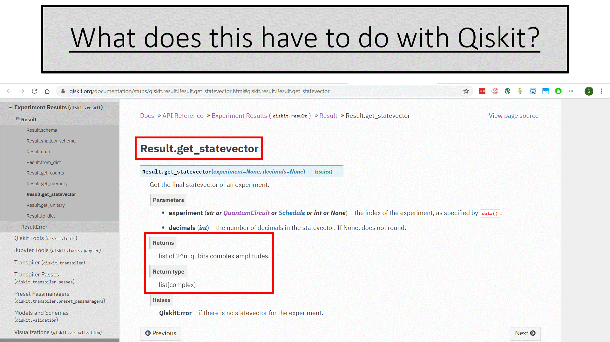

## IBM Quantum Challenge — Using Qiskit

A four-panel collage that introduces the virtual hackathon, spells out the intended audience (“not familiar” vs. “have studied” quantum computing), and shows the web portal and final challenge screen.

---

## Terminology

Defines **state**, **measurement**, and **calculation** while showing a canonical N-qubit circuit diagram.

---

## What does this have to do with Qiskit?

Highlights `Result.get_statevector()` in the Qiskit API to connect the theory with hands-on tooling.

---

## Google vs. IBM

Contrasts Google’s Sycamore claim with IBM’s Summit supercomputer paper, listing node counts and aggregate RAM.

---

## What we measure…

Shows how circuit measurements map to classical bit-strings \(C_0 … C_{2^N-1}\).

---

## Grover’s Algorithm with 3 Qubits

Top: textbook block diagram of the algorithm.  
Bottom: the actual Qiskit circuit implementing one Grover iteration.

---

## Grover Step 1 – Initialize

Applies Hadamards to all qubits, produces the uniform superposition state, and shows the equal-amplitude column vector.

---

## Initialize & Measure

Compares the raw amplitude table with the measured probability histogram after immediate read-out.

---

## One Full Iteration & Measure

Demonstrates a single Grover iteration: rotation in the two-dimensional {|w⟩, |s⟩} space and the corresponding histogram peak.

---

## Initialize, Phase Oracle & Measure

Isolates the effect of applying only the phase oracle before measurement.

---

## Let’s look at the basis of the calculation

Color-codes the huge circuit into **Initialization** (green), **Phase Oracle** (blue), and **Diffusion Operator** (red) blocks.

---

## Requirements – Part 1

Zooms in on the initialization and diffusion operator sections of the 62-qubit circuit.

---

## Requirements – Part 2

Introduces the 7-location graph problem and shows the oracle sub-circuit mapping those locations.

---

## Requirements – Combined

Reassembles Parts 1 & 2 into the full 62-qubit Grover circuit.

---

## First Simplification – 21-Input Toffoli

Replaces an 81-qubit oracle with a 21-control Toffoli, reducing ancilla overhead.

---

## Example 8-Input Toffoli Decomposition

Shows how a multi-controlled Toffoli can be broken into CNOT ladders plus ancilla qubits.

---

## Small Problem

Marks the initialization block that limits qubit count when scaling Grover’s algorithm.

---

## Hand Waving – Reversibility & Resource Estimates

Explains uncomputing to free qubits, compares 62- vs. 81-qubit versions, and displays the final result histogram.

---

## So about this score…

Screenshot of the IBM Quantum Challenge leaderboard highlighting team **SpoonBoyAndThePotentials** and their submission score.

