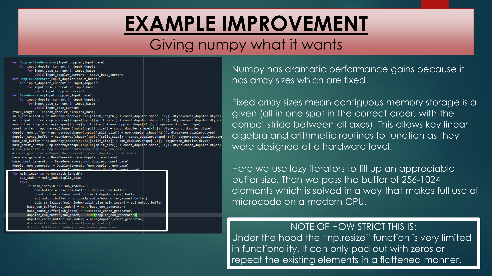

## Lindbladian Formalism  
**The missing to understanding quantum mechanics in real-world experimental terms**

---

## Short-Term: Speed  
Big optimizations possible for steady state solvers and time solvers.

---

## Example Issue: Serialization  
Large memory footprint for NumPy arrays.

---

## Example Issue: Serialization (Lazy Iterators)  
Use generators (`yield`) to reduce memory footprint.

---

## Example Improvement  
Give NumPy fixed, contiguous buffers.

---

## Mid-Term: Functionality & Speed  
Extend time-dependent functions; add GPU parallelization.

---

## Mid-Term: SaaS & BYOH  
Cloud deployment and Dockerized environments.

---

## Mid-Term: Does It Work?  
Experimental verification and validation.

---

## Long-Term: Functionality  
If it works there are all kinds of interesting directions to take things.

---

## Long-Term: What Errors Build Up?  
Alternate integration approaches: explicit/implicit Runge–Kutta and BDF (stiff ODEs).

---

## Long-Term: What If It’s Too Slow?  
Linear multistep methods and **quantum jump** (MCWF) alternatives.

---

### Summary
The Lindbladian formalism is both conceptually satisfying and an excellent candidate for practical **Runge–Kutta**. But making something fast and capable of running on a given hardware setup means understanding programming informed by computer science. This means buffered serialization, lazy iterators, possible **GPU acceleration**, and considering additional integration schemes (implicit RK/BDF, multistep, MCWF).