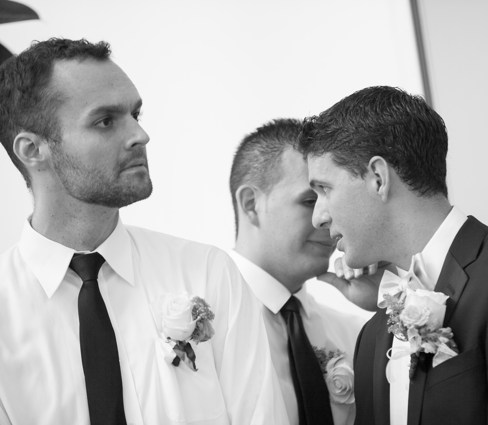
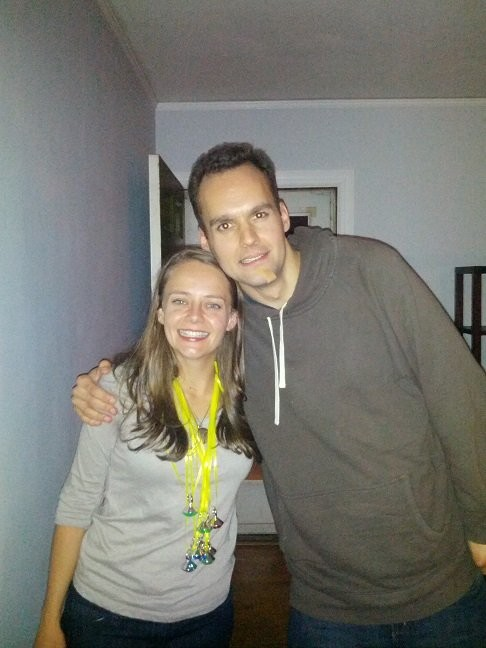
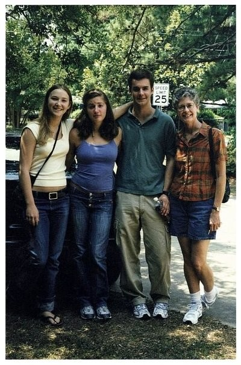
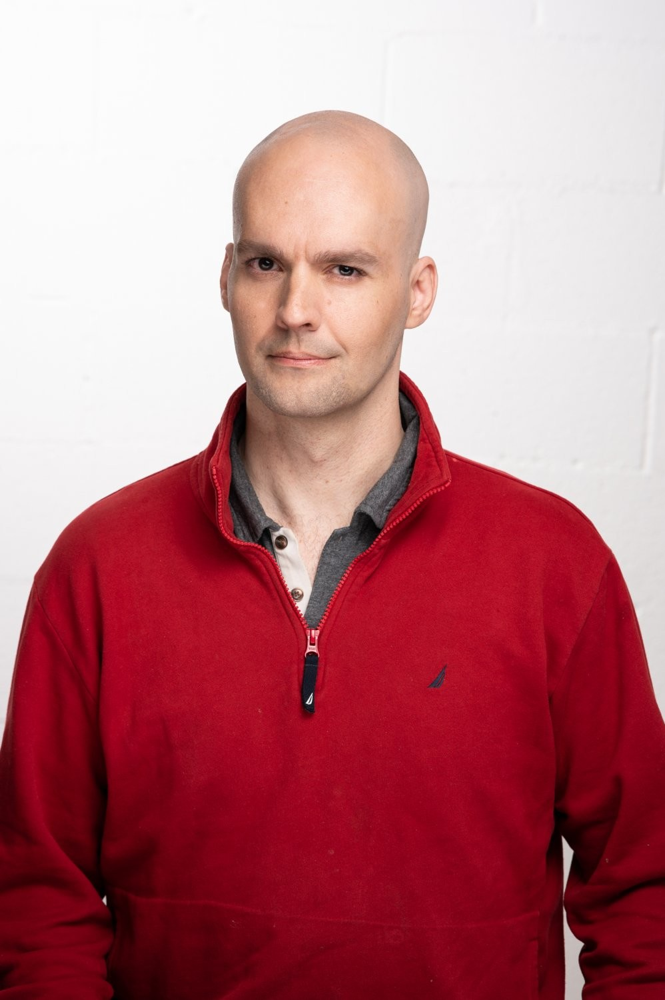
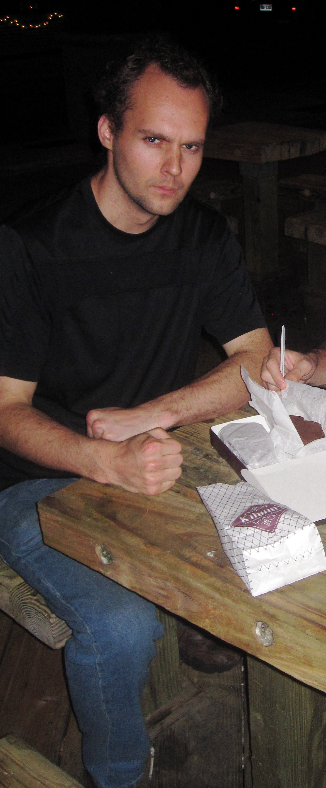
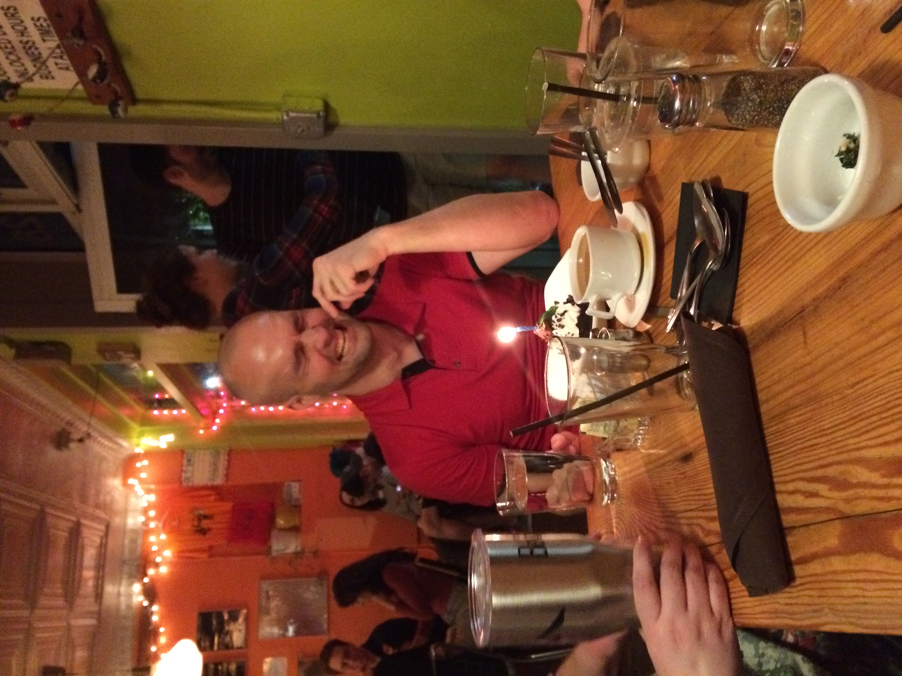

---
# the default layout is 'page'
icon: fas fa-info-circle
order: 4
layout: page
title: "About Me"
permalink: /about/
---

<!-- ===== Styles (leave as-is) ===== -->

<!-- ===== Replace these five paths ===== -->

  
  
  
  
  
  

# Hometown & Early Life

<!---  -->

I was born and raised in **Durham, North Carolina**—though I've had the good fortune to travel widely and even live overseas. In **Research Triangle** home, splitting most of my adult life between Durham early on and then Raleigh getting my bachelor's and master's in physics at NC State University. It was at this time that I was able to go from numerical physics to studying quantum information placing in multiple hackathons even optimizing specific algorithms for "practice problems" in quantum computing.

After taking a job at Coldquanta I spent a few years in Boulder Colorado before applying PhD programs and taking an offer at University of Central Florida where [I am currently working under Dr. Zhongzhou Chen!](https://sciences.ucf.edu/physics/person/zhongzhou-chen/)(also [here is a link to his personal website/blog](https://zhongzhou.github.io/the-learning-plumber/)). 

Our current work is studying Large Language Models and the dramatic changes they are already bringing to every aspect of how we teach Physics. The incredible pleasant surprise I have had is that between work in quantum computing and numerical methods I had most of the computer science building blocks to dive into the programming and math of Large Language models. Hoping to have more blog posts here about how that goes! I expect to soon have a tab on here outlining online resources to dig into the subject...

# Education

<!---  -->

* **North Carolina School of Science and Mathematics**  Residential, merit‑based public high school specializing in STEM. Diploma from this place is "Baptism by Fire" but your fellow NCSSM-ers are your comrades in arms, and your brain is forever on ludicrous speed!
* **North Carolina State University**

  * B.S. Physics, 2017
  * M.S. Physics, 2019

I include here a slide from a presentation that sums up my history as a researcher:

# Publications

<!---  -->

During my undergraduate and graduate years I conducted neutron‑physics research with the **Ultra‑Cold Neutron (UCNA) collaboration** at Duke’s TUNL and Los Alamos National Laboratory. Publications include:

* *Precision Measurement of the Neutron β‑Decay Asymmetry*
  [https://arxiv.org/abs/1210.7048](https://arxiv.org/abs/1210.7048)
* *New Result for the Neutron β‑Asymmetry Parameter A₀ from UCNA*
  [https://arxiv.org/abs/1712.00884](https://arxiv.org/abs/1712.00884)
* *Final Results for the Neutron β‑Asymmetry Parameter A₀ from the UCNA Experiment*
  [https://arxiv.org/abs/1904.05432](https://arxiv.org/abs/1904.05432)
* *Improved Limits on Fierz Interference Using Asymmetry Measurements from the UCNA Experiment*
  [https://arxiv.org/abs/1911.05829](https://arxiv.org/abs/1911.05829)
* *First Direct Constraints on Fierz Interference in Free Neutron β Decay*
  [https://arxiv.org/abs/1707.00776](https://arxiv.org/abs/1707.00776)
* *Search for Dark‑Matter Decay of the Free Neutron: n → χ + e⁺e⁻*
  [https://arxiv.org/abs/1803.10890](https://arxiv.org/abs/1803.10890)

# Research Expertise & Examples

## Laboratory/Experimental in AMO & Particle Physics

## Numerical/Modeling in Computational Physics (AMO, Nuclear, Quantum Computing)

# Selected Projects

<!---  -->

## Runge–Kutta in CUDA

Ported 10‑variable Cash–Karp Runge–Kutta neutron‑transport code to CUDA, achieving efficient double‑precision parallelism and gaining hard‑won experience with mixed GCC/NVCC build pipelines and CMake.

[Project github link here](https://github.com/NCSUNuclearPhysics/CUDA_UCN_SPIN)
# Awards & Highlights

<!---  -->
### IBM Quantum Hackathon 2020 – **2nd Place**

Co‑developed a prototype quantum‑enhanced game, overcoming real‑time engine integration hurdles to impress judges with functional gameplay and clear future potential.
[Link to IEEE Conference with Presentation of later version](https://ed.quantum.ieee.org/2020/11/) 

---

*Feel free to replace the image placeholders (`/assets/img/about/...`) with your own photos.*
